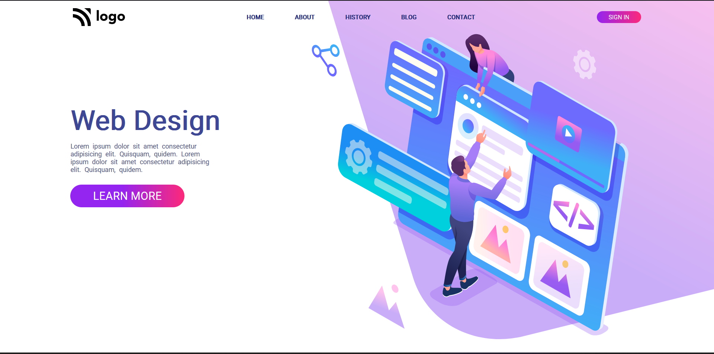

# Design-Landing-Page

Home page for web design organization

# Preview

# Overview 

- Designed with html5 and css3
- Used flexbox
- Tested on firefox

# Takeaways

- Positioning elements
- Using flexbox to align items properly
- Arranging SVG images for better looking websites.

# Links
[Demo](https://design-home-page.netlify.app/)
